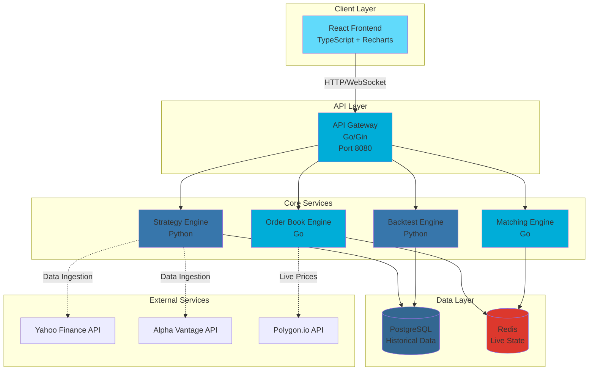
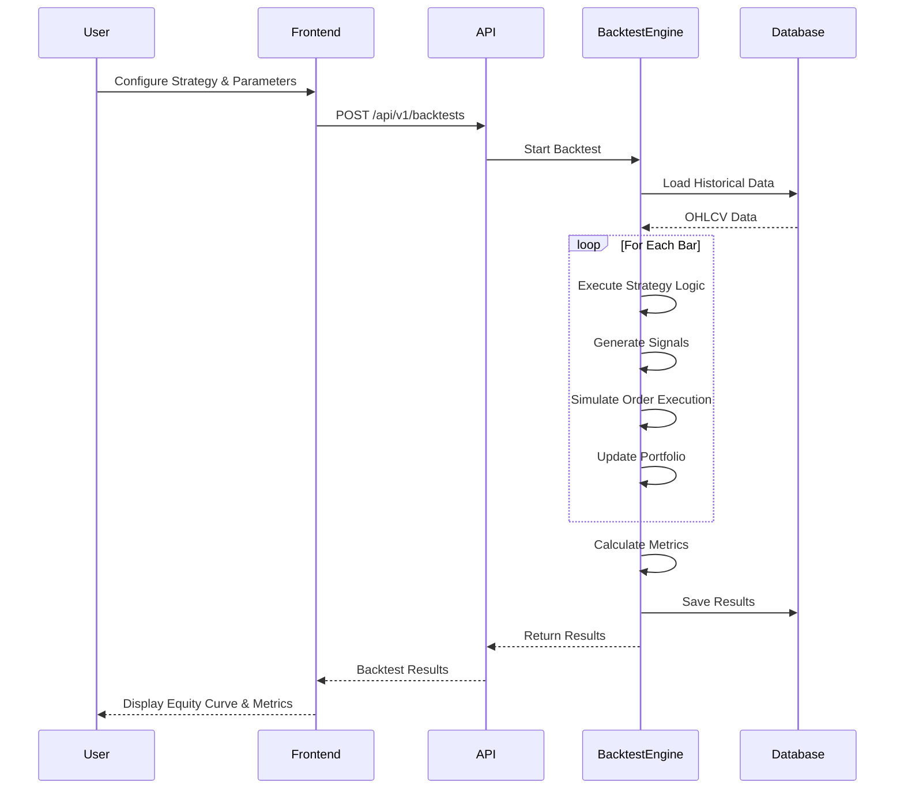
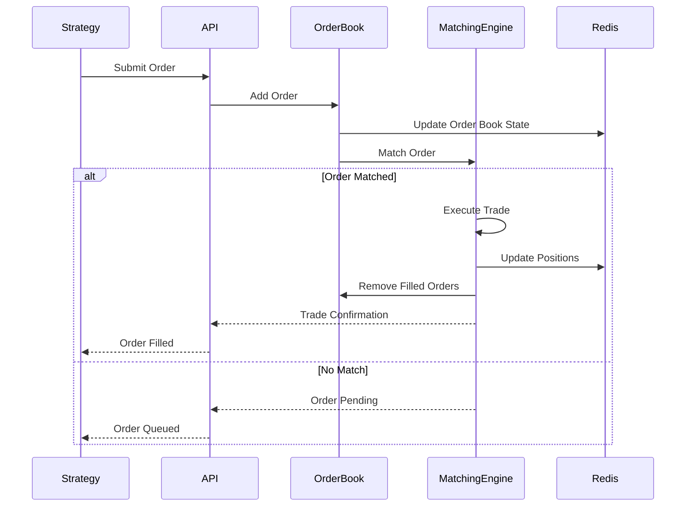
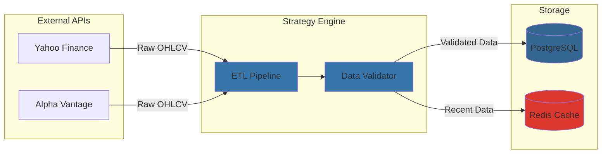
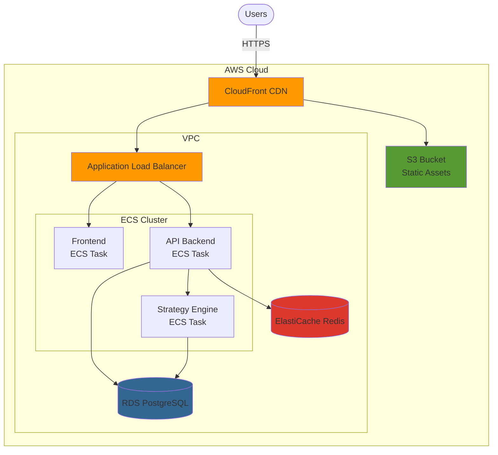

# ArbitraX Architecture

## System Architecture Diagram



## Data Flow Diagrams

### Backtesting Flow



### Live Order Execution Flow



### Data Ingestion Flow



## Component Responsibilities

### Frontend (React + TypeScript)
- **Components**: BacktestForm, EquityCurve, TradeLog, PerformanceMetrics, OrderBook, LiveDashboard
- **Responsibilities**:
  - User interface for strategy configuration
  - Data visualization (charts, tables, heatmaps)
  - Real-time updates via WebSocket
  - State management (React Context/Redux)

### API Gateway (Go/Gin)
- **Endpoints**: `/health`, `/api/v1/*`
- **Responsibilities**:
  - Request routing and validation
  - Authentication & authorization (future)
  - Rate limiting
  - WebSocket connections for live data
  - API documentation (Swagger/OpenAPI)

### Order Book Engine (Go)
- **Data Structures**: Binary heaps for bid/ask queues
- **Responsibilities**:
  - Maintain real-time order book state
  - Price-time priority ordering
  - Order validation
  - Book snapshots for recovery

### Matching Engine (Go)
- **Algorithm**: Price-time priority matching
- **Responsibilities**:
  - Match buy/sell orders
  - Handle partial fills
  - Generate trade events
  - Update positions in Redis

### Strategy Engine (Python)
- **Modules**: `strategies/`, `backtesting/`, `data/`, `utils/`
- **Responsibilities**:
  - Strategy implementation (SMA, RSI, ML models)
  - Backtest orchestration
  - Performance metrics calculation
  - Risk analytics (VaR, Sharpe, drawdown)

### Backtest Engine (Python)
- **Framework**: Custom engine built on pandas
- **Responsibilities**:
  - Historical data replay
  - Signal generation
  - Position tracking
  - Equity curve calculation
  - Trade logging

## Database Schema

### PostgreSQL Tables

```
assets
├── id (UUID, PK)
├── symbol (VARCHAR)
├── name (VARCHAR)
├── asset_type (VARCHAR)
└── timestamps

historical_prices
├── id (BIGSERIAL, PK)
├── asset_id (FK -> assets)
├── timestamp (TIMESTAMPTZ)
├── open, high, low, close, volume (DECIMAL)
└── created_at

strategies
├── id (UUID, PK)
├── name (VARCHAR)
├── strategy_type (VARCHAR)
├── parameters (JSONB)
└── timestamps

backtests
├── id (UUID, PK)
├── strategy_id (FK -> strategies)
├── asset_id (FK -> assets)
├── metrics (sharpe_ratio, max_drawdown, etc.)
├── results (JSONB)
└── timestamps

orders
├── id (UUID, PK)
├── backtest_id (FK -> backtests)
├── order_type, side, quantity, price
├── status (pending/filled/cancelled)
└── timestamps

trades
├── id (UUID, PK)
├── backtest_id (FK -> backtests)
├── entry_price, exit_price, quantity
├── pnl, pnl_percentage
└── timestamps
```

### Redis Data Structures

```
orderbook:{symbol} -> Hash
├── bids -> Sorted Set (price -> quantity)
├── asks -> Sorted Set (price -> quantity)
└── last_price -> String

positions:{backtest_id} -> Hash
├── {asset_id} -> JSON {quantity, avg_price, unrealized_pnl}

live:prices:{symbol} -> String (latest price)

cache:historical:{symbol}:{date} -> JSON (OHLCV data)
```

## Technology Justifications

### Why Go for Order Book?
- **Performance**: Low-latency order matching (<1ms)
- **Concurrency**: Goroutines for handling multiple order streams
- **Memory Safety**: No manual memory management
- **Compiled**: Fast execution for hot paths

### Why Python for Strategies?
- **Libraries**: pandas, numpy, scikit-learn ecosystem
- **Rapid Development**: Quick iteration on strategy ideas
- **Community**: Extensive quant finance libraries
- **Flexibility**: Easy to prototype ML models

### Why PostgreSQL?
- **Reliability**: ACID compliance for trade data
- **JSONB**: Flexible storage for strategy parameters
- **Indexing**: Fast time-series queries
- **Mature**: Production-proven

### Why Redis?
- **Speed**: In-memory for live order book state
- **Pub/Sub**: WebSocket broadcasting
- **Data Structures**: Sorted sets for order queues
- **Persistence**: AOF for recovery

## Deployment Architecture



## Performance Targets

| Component | Metric | Target |
|-----------|--------|--------|
| Order Matching | Latency | <1ms p99 |
| API Response | Latency | <100ms p99 |
| Backtest (1 year data) | Duration | <5 seconds |
| WebSocket Updates | Frequency | 100 updates/sec |
| Database Queries | Latency | <10ms p95 |

## Security Considerations

- [ ] API authentication (JWT tokens)
- [ ] Rate limiting per user/IP
- [ ] Input validation and sanitization
- [ ] SQL injection prevention (parameterized queries)
- [ ] HTTPS/TLS for all communications
- [ ] Secrets management (AWS Secrets Manager)
- [ ] CORS configuration
- [ ] Database connection pooling

## Scalability Considerations

- **Horizontal Scaling**: Stateless API servers behind load balancer
- **Database Sharding**: Partition by asset_id for historical_prices
- **Read Replicas**: PostgreSQL replicas for read-heavy queries
- **Caching**: Redis for hot data and query results
- **CDN**: CloudFront for static assets and API responses
- **Queue System**: Future: Add RabbitMQ for async backtest jobs

## Monitoring & Observability

- **Metrics**: Prometheus + Grafana
- **Logging**: Structured JSON logs → CloudWatch/ELK
- **Tracing**: OpenTelemetry for distributed tracing
- **Alerting**: PagerDuty integration for critical failures
- **Dashboards**:
  - System health (CPU, memory, disk)
  - Business metrics (backtests/hour, trades executed)
  - Error rates and latency percentiles
